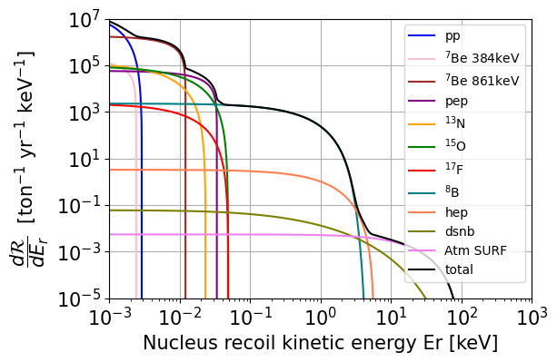
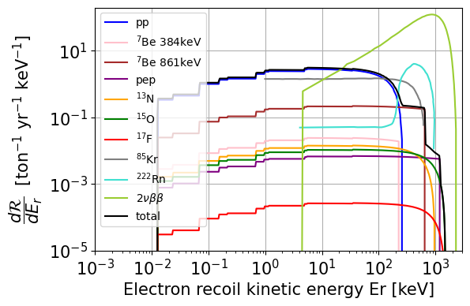

# neutrino_spectrum

Computes neutrino-nucleus (NR) and neutrino-electron (ER) elastic scattering
rate spectra for liquid noble gas detectors (Xe, Ar, He).

---
Result


## Repository structure

```
neutrino_spectrum/
├── solar_neutrino_flux/          flux shape files [E, dN/dE] for pp, hep, 8B, N13, O15, F17
├── atm_neutrino_flux/            atmospheric neutrino flux files by site and model #
├── neutrino-Nucleus_el/          output: NR unnormalized cross-section files (generated)
├── neutrino-electron_el/         output: ER unnormalized cross-section files (generated)
├── measured_spectrum/            pre-normalized background spectra: Kr85, Rn222, nubb
├── Pee.txt                       energy-dependent electron neutrino survival probability
│                                 ref: https://arxiv.org/pdf/1208.5723.pdf
├── scatter_kinematics.py         recoil energy kinematics (Er_max, Er_min)
├── scatter_target.py             target nucleus properties (A, Z, binding energies)
├── scatter_xsec_el.py            differential cross sections dσ/dEr for NR and ER
├── neutrino_flux.py              flux shapes and normalizations for all sources
├── compute_unnormed_xsec.py      step 1: compute dσ/dEr [cm²/keV] and save to disk
├── cross_section_to_rate.py      step 2: convert [cm²/keV] → [ton⁻¹ yr⁻¹ keV⁻¹]
└── get_detected_spectrum.py      step 3: sum sources → ideal or realistic spectrum + plot
```

---

## Related repositories

This repository expects the following sibling directories:

```
~/projects/
├── neutrino_spectrum/      ← this repo
├── wimp_spectrum/          ← https://github.com/YZHUANGwork/WIMP_spectrum
└── detector_efficiency/    ← https://github.com/YZHUANGwork/detector_efficiency
└── phasor_decomp/          ← https://github.com/YZHUANGwork/phasor_decomp
```

Detector efficiency files are read from `../detector_efficiency/` by default.
Clone all three repositories into the same parent folder.

---

## Pipeline

```
Step 1   compute_unnormed_xsec.py
         Integrates dσ/dEr(Er, Eν) × dΦ/dEν over neutrino energy
         → saves _UNNORMpdf.txt [cm²/keV]  (run once per source/target)

Step 2   cross_section_to_rate.py
         × flux normalization [cm⁻² s⁻¹]
         × target number density [ton⁻¹]
         → dR/dEr [ton⁻¹ yr⁻¹ keV⁻¹]  (called automatically, not run directly)

Step 3   get_detected_spectrum.py
         User selects sources, channel, target, mode
         → ideal:     sum sources only
         → realistic: sum → Gaussian smearing → detector efficiency
```

---

## Neutrino sources

| Source | Type | Channel |
|--------|------|---------|
| pp, hep, 8B, N13, O15, F17 | continuum solar | NR and ER |
| Be7_384, Be7_861, pep | mono-energetic solar | NR and ER |
| atmNu_loc_avg | atmospheric | NR only |
| dsnb | diffuse supernova | NR only |

Flux normalizations from GS98 (metallicity='high') or AGSS09 (metallicity='low').

Radioactive backgrounds (ER only, already normalized):
- Kr85, Rn222, nubb (2νββ) — stored in `measured_spectrum/`

---

## Detector targets

| Target | A | Z |
|--------|---|---|
| Xe | 131.293 | 54 |
| Ar | 39.948 | 18 |
| He | 4 | 2 |

---

## Usage

### Step 1 — compute unnormed cross sections (run once)

Edit the bottom of `compute_unnormed_xsec.py` to set your sources and target, then:

```bash
python compute_unnormed_xsec.py
```

Or call directly from a script or notebook:

```python
from compute_unnormed_xsec import compute_NR_unnormed, compute_ER_unnormed

compute_NR_unnormed('8B', 'Xe', plot=True)       # check plot shown, file saved
compute_ER_unnormed('pp', 'Xe', flavor='both')   # saves nue and numutau files
```

Set `overwrite=False` to skip sources already computed.

### Step 2+3 — get spectrum

```python
from get_detected_spectrum import get_detected_spectrum, plot_spectrum

# NR, ideal (sum only, no detector effects)
Er, rate = get_detected_spectrum(
    target     = 'Xe',
    channel    = 'NR',
    nu_sources = ['pp', 'Be7_861', 'pep', '8B', 'hep', 'N13', 'O15', 'F17',
                  'dsnb', 'atmNu_SURF_avg'],
    mode       = 'ideal')

# NR, realistic (smearing + detector efficiency)
Er, rate = get_detected_spectrum(
    target     = 'Xe',
    channel    = 'NR',
    nu_sources = ['pp', 'Be7_861', '8B', 'atmNu_SURF_avg'],
    mode       = 'realistic',
    detector   = 'LZ')

# ER, realistic, neutrinos + backgrounds
Er, rate = get_detected_spectrum(
    target       = 'Ar',
    channel      = 'ER',
    nu_sources   = ['pp', 'Be7_861', 'pep', 'N13', 'O15', 'F17'],
    bkgd_sources = ['Kr85', 'Rn222', 'nubb'],   # optional
    mode         = 'realistic',
    detector     = 'ideal Ethrd1keV')

plot_spectrum(Er, rate)
```

### Detector strings

| String | Description |
|--------|-------------|
| `'LZ'`, `'Xe1t'`, ... | reads `../detector_efficiency/det_eff_<name>_<interaction>.*` |
| `'LUX03'` | analytic parametric efficiency |
| `'ideal Ethrd1keV'` | step function, threshold at 1 keV |
| `'ideal Ethrd0.1keV'` | step function, threshold at 0.1 keV |

---


## Dependencies

```
numpy
astropy
scipy
matplotlib
```
